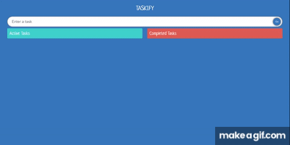

<a name="readme-top"></a>

[![Contributors][contributors-shield]][contributors-url]
[![Forks][forks-shield]][forks-url]
[![Stargazers][stars-shield]][stars-url]
[![Issues][issues-shield]][issues-url]
[![MIT License][license-shield]][license-url]
[![LinkedIn][linkedin-shield]][linkedin-url]


<!-- PROJECT LOGO -->
<br />
<div align="center">
  <a href="https://taskify-tsr.netlify.app/">
    
  </a>

  <p align="center">
    An awesome Todo app organise your tasks!
    <br />
    <a href="https://github.com/Staroyee/ts-react-todos"><strong>Explore the docs »</strong></a>
    <br />
    <br />
    <a href="https://taskify-tsr.netlify.app/">View Demo</a>
    ·
    <a href="https://github.com/Staroyee/ts-react-todos/issues">Report Bug</a>
    ·
    <a href="https://github.com/Staroyee/ts-react-todos/issues">Request Feature</a>
  </p>
</div>


<!-- TABLE OF CONTENTS -->
<details>
  <summary>Table of Contents</summary>
  <ol>
    <li>
      <a href="#about-the-project">About The Project</a>
      <ul>
        <li><a href="#built-with">Built With</a></li>
      </ul>
    </li>
    <li>
      <a href="#getting-started">Getting Started</a>
      <ul>
        <li><a href="#prerequisites">Prerequisites</a></li>
        <li><a href="#installation">Installation</a></li>
      </ul>
    </li>
    <li><a href="#usage">Usage</a></li>
    <li><a href="#roadmap">Roadmap</a></li>
    <li><a href="#contributing">Contributing</a></li>
    <li><a href="#license">License</a></li>
    <li><a href="#contact">Contact</a></li>
    <li><a href="#acknowledgments">Acknowledgments</a></li>
  </ol>
</details>


<!-- ABOUT THE PROJECT -->
## About The Project



I wanted to improve my typescript skills so I took to the internet and went through the tutorial I found by freeCodeCamp -
<a href="https://www.youtube.com/watch?v=FJDVKeh7RJI">Watch Tutorial Here</a>

The project provides an application where a user can enter todos, edit, delete, drag/drop and check them off.

<p align="right">(<a href="#readme-top">back to top</a>)</p>


### Built With

This section should list any major frameworks/libraries used to bootstrap your project. Leave any add-ons/plugins for the acknowledgements section. Here are a few examples.

* [![React][React.js]][React-url]
* <a href="https://github.com/atlassian/react-beautiful-dnd">React-Beautiful-Dnd</a>


<p align="right">(<a href="#readme-top">back to top</a>)</p>


<!-- GETTING STARTED -->
## Getting Started

The following steps explain how to install this project on your local machine.

### Installation

_Below is an example of how you can instruct your audience on installing and setting up your app. This template doesn't rely on any external dependencies or services._

1. Clone the repo
   ```sh
   git clone https://github.com/Staroyee/ts-react-todos.git
   ```
2. Install NPM packages
   ```sh
   npm install
   ```
3. Run the app in a development environment
   ```sh
   npm run dev
   ```

<p align="right">(<a href="#readme-top">back to top</a>)</p>


<!-- USAGE EXAMPLES -->
## Usage

* Enter todo items

* Mark todos as done

* Edit todos

* Delete todos

* Drag & drop todos


_For more examples, please refer to the [Documentation](https://github.com/Staroyee/ts-react-todos)_

<p align="right">(<a href="#readme-top">back to top</a>)</p>


<!-- ROADMAP -->
## Roadmap

- [ ] Add dark mode
- [ ] Adjust styles 


See the [open issues](https://github.com/Staroyee/ts-react-todos/issues) for a full list of proposed features (and known issues).

<p align="right">(<a href="#readme-top">back to top</a>)</p>


<!-- CONTRIBUTING -->
## Contributing

Contributions are what make the open source community such an amazing place to learn, inspire, and create. Any contributions you make are **greatly appreciated**.

If you have a suggestion that would make this better, please fork the repo and create a pull request. You can also simply open an issue with the tag "enhancement".
Don't forget to give the project a star! Thanks again!

1. Fork the Project
2. Create your Feature Branch (`git checkout -b feature/AmazingFeature`)
3. Commit your Changes (`git commit -m 'Add some AmazingFeature'`)
4. Push to the Branch (`git push origin feature/AmazingFeature`)
5. Open a Pull Request

<p align="right">(<a href="#readme-top">back to top</a>)</p>


<!-- LICENSE -->
## License

Distributed under the MIT License. See `LICENSE.txt` for more information.

<p align="right">(<a href="#readme-top">back to top</a>)</p>


<!-- CONTACT -->
## Contact

Your Name: [Daniel Masefield](https://www.linkedin.com/in/danielmasefield03/)

Project Repo Link: [Github](https://github.com/Staroyee/ts-react-todos)

Project Live Site Link: [Live Site](https://taskify-tsr.netlify.app/)
<p align="right">(<a href="#readme-top">back to top</a>)</p>


<!-- ACKNOWLEDGMENTS -->
## Acknowledgments

* [Choose an Open Source License](https://choosealicense.com)
* [GitHub Emoji Cheat Sheet](https://www.webpagefx.com/tools/emoji-cheat-sheet)
* [Malven's Flexbox Cheatsheet](https://flexbox.malven.co/)
* [Malven's Grid Cheatsheet](https://grid.malven.co/)
* [Img Shields](https://shields.io)
* [GitHub Pages](https://pages.github.com)
* [Font Awesome](https://fontawesome.com)
* [React Icons](https://react-icons.github.io/react-icons/search)

<p align="right">(<a href="#readme-top">back to top</a>)</p>


<!-- MARKDOWN LINKS & IMAGES -->
[contributors-shield]: https://img.shields.io/github/contributors/Staroyee/ts-react-todos.svg?style=for-the-badge
[contributors-url]: https://github.com/Staroyee/ts-react-todos/graphs/contributors
[forks-shield]: https://img.shields.io/github/forks/Staroyee/ts-react-todos.svg?style=for-the-badge
[forks-url]: https://github.com/Staroyee/ts-react-todos/network/members
[stars-shield]: https://img.shields.io/github/stars/Staroyee/ts-react-todos.svg?style=for-the-badge
[stars-url]: https://github.com/Staroyee/ts-react-todos/stargazers
[issues-shield]: https://img.shields.io/github/issues/Staroyee/ts-react-todos.svg?style=for-the-badge
[issues-url]: https://github.com/Staroyee/ts-react-todos/issues
[license-shield]: https://img.shields.io/github/license/Staroyee/ts-react-todos.svg?style=for-the-badge
[license-url]: https://github.com/Staroyee/ts-react-todos/blob/main/LICENSE
[linkedin-shield]: https://img.shields.io/badge/-LinkedIn-black.svg?style=for-the-badge&logo=linkedin&colorB=555
[linkedin-url]: https://www.linkedin.com/in/danielmasefield03/
[product-screenshot]: images/screenshot.png
[Next.js]: https://img.shields.io/badge/next.js-000000?style=for-the-badge&logo=nextdotjs&logoColor=white
[React-url]: https://reactjs.org/
[Vue.js]: https://img.shields.io/badge/Vue.js-35495E?style=for-the-badge&logo=vuedotjs&logoColor=4FC08D